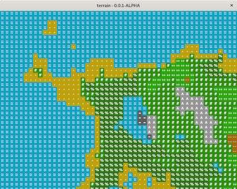

# TERRAIN

  

## Description

Terrain is a simple procedural world generator using perlin noise in c++. I have attempted to optimise where possible but expect improvements can be made. I've also introduced a very basic profiler which is somewhat effective.

## Dependencies
- Compiler that supports C++17
- cmake
- SDL2

## Usage

First clone the directory, create a build folder and then call cmake. You can also include the `-DCMAKE_BUILD_TYPE=Debug` flags if you wish to view all of the debug messages that terrain generates and observe performance.

- `cd terrain`
- `mkdir build && cd build`
- `cmake ..` or `cmake .. -DCMAKE_BUILD_TYPE=Debug`
- `./terrain` or `./terrain -s 12345`

As exemplified above you can either run the application `terrain` using the default seed or supply a seed using `terrain -s <SEED>`.
