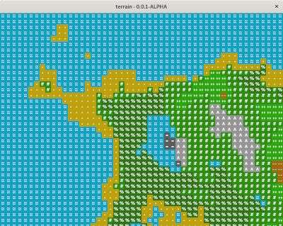

# TERRAIN

  

## Description

Terrain is a simple procedural world terrain generator that utilises perlin noise to create a world map in c++. I have attempted to optimise where possible but expect improvements can be made. There are various configuration setting which can be modified within `init.json` to save recompilation.

## Dependencies
- C++17
- cmake
- SDL2

## Building

First clone the directory, create a build folder and then call `cmake ..`. You can also include the `-DCMAKE_BUILD_TYPE=Debug` flags if you wish to view all of the debug messages that terrain generates and observe performance. For example:

- `git clone git@github.com:chortlesource/terrain.git`
- `cd terrain`
- `mkdir build && cd build`
- `cmake ..` or `cmake .. -DCMAKE_BUILD_TYPE=Debug`

## Usage

You can either run the application `terrain` using the default seed or supply a seed using `terrain -s <SEED>`. For example:

`./terrain` or `./terrain -s 12345`

## Licence

terrain copyright (c) 2020 Christopher M. Short

terrain is free software: you can redistribute it and/or modify it under the terms of the GNU General Public License as published by the Free Software Foundation, either version 3 of the License, or (at your option) any later version.

terrain is distributed in the hope that it will be useful, but WITHOUT ANY WARRANTY; without even the implied warranty of MERCHANTABILITY or FITNESS FOR A PARTICULAR PURPOSE. See the GNU General Public License for more details.

A copy of the GNU General Public License is available [here](https://www.gnu.org/licenses/).
